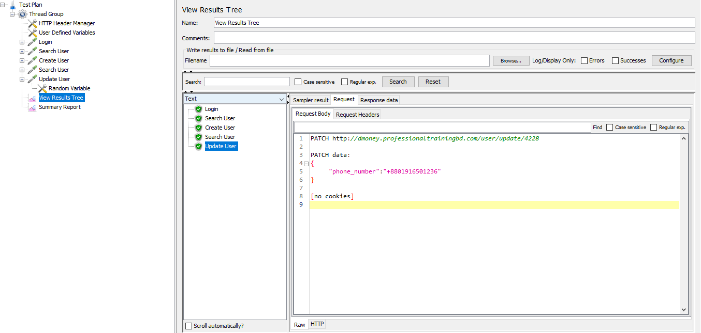
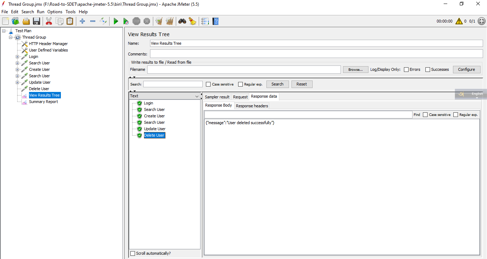
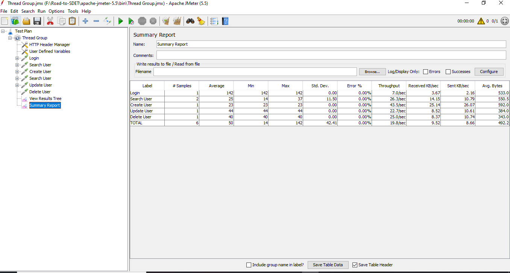
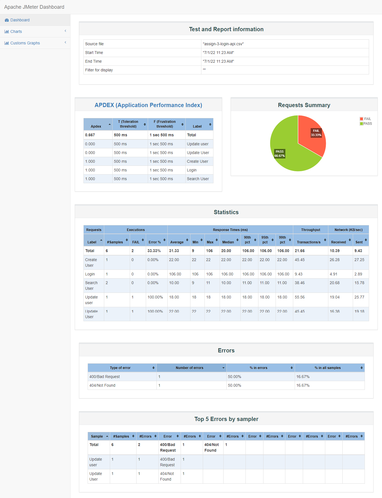

## JMeter Assignment 02

#### **Solved:**

- #### [Testing Server API](http://dmoney.professionaltrainingbd.com)

#### How to run this project

- #### Clone this project

- #### Move file into **\apache-jmeter-5.5\bin** this path

- #### Open any terminal & run below this command

- #### jmeter -n -t "your jmx file" -l "log_file_name.csv" -e -o Reports

#### Following Steps

- #### Create user

- #### Search User

- #### Update user by id specific property

- #### Delete user

#### API Test Strategy

- [Server](https://demoqa.com/BookStore/v1/Books)

- Update user response:

|  |
| :--------------------------------------------------: |
|              _Jmeter Test Collection 1_              |

- Delete User Response:

|  |
| :--------------------------------------------------: |
|              _Jmeter Test Collection 2_              |

#### **JMeter Summary Report**

- Test Report Summary

|  |
| :-----------------------------------------: |
|                  _Summary_                  |

- Test Report Statistics

|  |
| :-----------------------------------------: |
|                _Statistics_                 |
